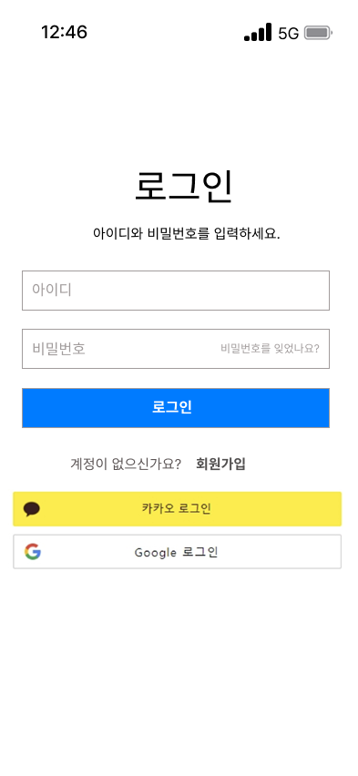
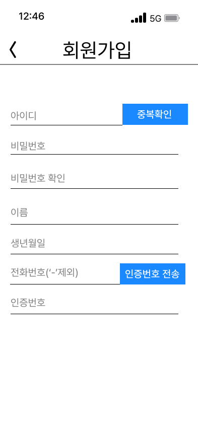
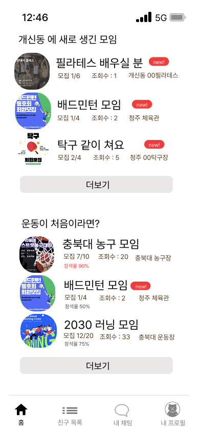

# 🏋️‍♀️ 동만이 (Dongmani) - 오픈소스전문프로젝트

> "운동은 함께할 때 더 즐겁다"  
> 동호회 기반의 **참여율 추적**, **인증 시스템**, **이미지 기반 출석 체크**까지 가능한 스마트 커뮤니티 앱

---

## 📱 사용자 플로우 미리보기

> 아래 이미지를 통해 앱의 주요 흐름을 한눈에 확인할 수 있습니다.

| 인트로 화면 | 로그인 화면 | 회원가입 화면 | 메인 화면 |
|-------------|-------------|----------------|------------|
|  |  |  |  |

---

## 💡 아이디어 핵심 포인트

> 함께한 기록이 가치를 만든다!

- 📊 **동아리 참석률 추적**
- 📍 **지도 기반 위치 확인 (주소 클릭 시 지도 연결)**
- 🥇 **매너 점수/출석률 기반 우수 유저 프로필 상단 고정**
- 🖼️ **모임 인증사진 업로드 → 홈화면 상단 배치**
- 🧠 **OpenCV 이미지 인식으로 참석 인원 자동 파악**
- ✅ **참석자 수 vs 사전 신청자 수 → 자동 출석률 계산**
- 🎁 **출석률/매너 점수 기반 포인트 & 어드벤티지 지급**
- 📌 **포인트 높은 모임은 메인 화면 상단 고정**
- 🔥 **한 달 포인트 1위 모임은 별도 광고 창에 노출**

---

## 🎨 디자인 & 리소스 링크

- 🖼️ [Figma ver.1](https://www.figma.com/design/OTg5VRfihSNC5goiBtG6Dm/Dongmani?node-id=0-1&p=f&t=SIgXPEVEIDxkNGNl-0)  
- 🧪 [Figma ver.2](https://www.figma.com/design/tPXTx3xhPB6JhA1DWHtvTk/Untitled?node-id=0-1&p=f&t=4rLG65RSOiHMpv2B-0)  
- 🔤 [Figma Font Installer](https://www.figma.com/downloads/?fuid=843356296609220310)  
- 🧸 [학교안심 둥근미소 폰트](https://gongu.copyright.or.kr/gongu/wrt/wrt/view.do?wrtSn=13372623&menuNo=200195)  
- 📷 [Android + OpenCV 모임 인식 참고](https://brunch.co.kr/@mystoryg/76)

---

## 🧩 개발 To-do List

```txt
✅ 화면 기획 및 UI 설계 (Figma → XML)
✅ Android에서 기능 구현 (더미데이터 기반)
✅ Firebase Firestore 데이터베이스 구조 설계
✅ Firebase Authentication 연동 (Google/Kakao 로그인)
⬜ Firebase Storage를 통한 이미지 업로드
⬜ 이미지 인식(OpenCV) 기능 구현 및 연동
⬜ 전체 기능 테스트 및 앱 배포
```

---

## ⚙️ 개발 환경 설정

```yaml
UI 설계도구      : Figma
개발도구         : Android Studio (Java + Kotlin)
프론트엔드       : XML
백엔드           : Firebase (Authentication + Firestore + Storage)
이미지 인식      : OpenCV
```

- ✅ **AVD 시뮬레이터**: Pixel 7  
- ✅ **Java 버전**: 17.0.12  
- ✅ **Kotlin 버전**: 2.1.20-RC2  
- ✅ **Firebase 구성**
  ```
  Authentication: Google, Kakao OAuth
  Database: Firestore
  Storage: Firebase Storage (사진 업로드)
  ```

---

## 🤝 팀 노트

- 로그인, 회원가입은 **Google/Kakao 소셜 로그인과 Firestore 연동**으로 구현
- 모든 모임은 사용자 인증 기반으로 신뢰성 있는 참석률 측정 가능
- 꾸준한 참여 → 리워드 제공 → 모임 활성화 → 동아리의 성장
