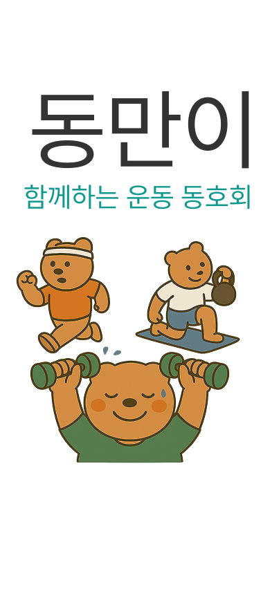
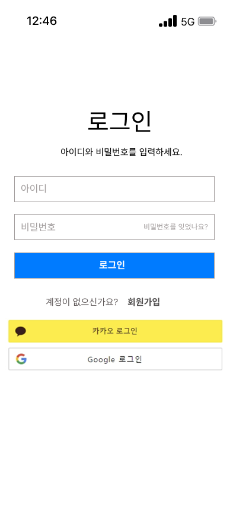
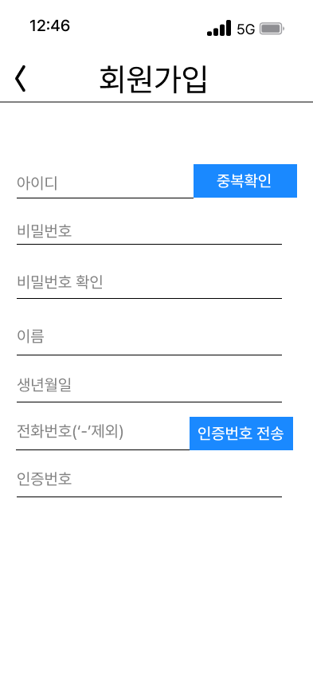
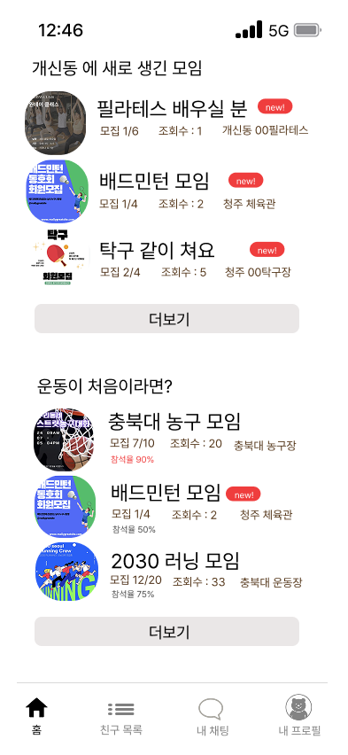
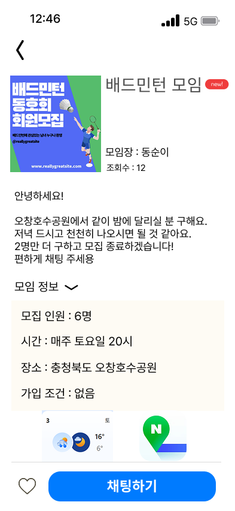
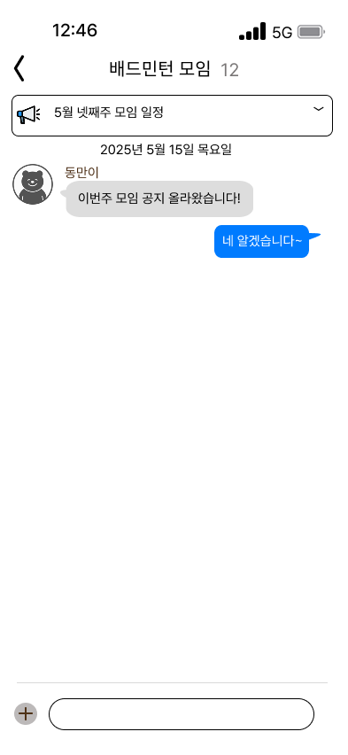

# 🏋️‍♀️ 동만이 (Dongmani) - 오픈소스 전문 프로젝트

> "운동은 함께할 때 더 즐겁다"
> 동호회 기반의 **참여율 추적**, **인증 시스템**, **이미지 기반 출석 체크**까지 가능한 스마트 커뮤니티 앱

---

<br/>

## 📱 사용자 플로우 미리보기

> 아래 이미지를 통해 앱의 주요 흐름을 한눈에 확인할 수 있습니다.

| 인트로 화면 | 로그인 화면 | 회원가입 화면 | 메인 화면 |
|-------------|-------------|----------------|------------|
|  |  |  |  |

| 글 세부 화면 | 채팅 화면 |
|---------------|-------------|
|  |  | [1]!(images/Screenshot 2025-06-20 at 09 03 43)| [2]!(images/Screenshot 2025-06-20 at 09 03 43)|


---

<br/>

## 💡 아이디어 핵심 포인트

> 함께한 기록이 가치를 만든다!

-   📊 **동아리 참석률 추적**: 모임 참여 인원을 자동으로 파악하여 사전 신청자 수와 비교, 출석률을 계산합니다.
-   📍 **지도 기반 위치 확인**: 모임 게시글에 등록된 주소를 클릭하면 지도 앱(Google Maps)과 연동하여 위치를 확인할 수 있습니다.
-   🥇 매너 점수/출석률 기반 우수 유저 프로필 상단 고정 (계획 중)
-   🖼️ 모임 인증사진 업로드 → 홈화면 상단 배치
-   🧠 **Google ML Kit 이미지 인식으로 참석 인원 자동 파악**: 사진 내 사람 객체(바운딩 박스 기준)를 감지하여 모임 참여 인원을 자동으로 파악합니다.
-   ✅ 익명 게시판 운영: 부담되지 않게 모임 참석 및 채팅이 가능한 익명 게시판을 운영합니다.
-   🎁 출석률/매너 점수 기반 포인트 & 어드벤티지 지급
-   📌 포인트 높은 모임은 메인 화면 상단 고정
-   🔥 한 달 포인트 1위 모임은 별도 광고 창에 노출)

---

<br/>

## 📅 스크럼 개발일지

### 📊 주차별 주요 활동 및 성과

| 주차 | 주요 활동 내용 |
|------|----------------|
| **1회차** | ✅ Figma를 통해 전체 UI 구성 완료<br>✅ Android XML 레이아웃 초안 구현<br>🛠️ Firebase Firestore 기반 데이터베이스 구조 설계 및 문서화 시작<br>📄 프로젝트 README 및 개발 가이드 초안 작성<br>📁 프로젝트 초기 파일 구조 세팅 완료 |
| **2회차** | ✅ 회원가입 화면 UI 및 Firebase Authentication 연동 완료<br>✅ Firebase Firestore 구조 초기화 및 샘플 데이터 삽입<br>📸 주요 사용자 흐름 화면(인트로, 로그인, 회원가입) 캡처 및 README 반영<br>🔧 앱 초기 진입 및 인증 관련 기본 기능 테스트 및 디버깅 |
| **3회차** | ✅ 홈 화면(메인 화면) 주요 기능 레이아웃 구성 완료 <br>✅ Firestore와 연동한 실시간 데이터(게시글 목록) 읽기 기능 구현 및 최적화<br>✅ `DetailActivity`에서 **Google Maps 연동**을 통한 모임 장소 확인 기능 구현<br>✅ 앱 초기 진입 흐름 및 데이터 로딩 방식 안정화 |
| **4회차** | ✅ **Firebase Authentication 연동 심화**: 로그인 및 회원가입 기능 안정화, 앱 전역적인 세션 유지 처리 (Custom Application 클래스 `DongmanApp` 활용).<br>✅ **게시물 작성 및 Firebase Storage 이미지 업로드**: 다중 이미지 선택, Firebase Storage로의 비동기 업로드 및 다운로드 URL Firestore 저장 기능 구현.<br>✅ **Google ML Kit Object Detection 구현**: `DetailActivity`에서 게시물 이미지 로드 시 사람 수 자동 감지 및 바운딩 박스 시각화, 참여율 계산 로직 통합.<br>✅ **Firebase 보안 규칙 설정**: 개발 및 테스트를 위한 Firestore 및 Storage의 `read, write: true;` (혹은 `if request.auth != null;`) 규칙 설정 및 배포 (추후 프로덕션 환경에 맞춰 강화 예정).<br>✅ **주요 버그 수정**:
| **5회차** | ✅ **전체 기능 QA 테스트 및 앱 배포 준비**<br>✅ `MainActivity` 필터/탭 기능(인기순, 조회순, 가까운순)에 대한 Firestore 쿼리 로직 구체화<br>✅ 매너 점수/포인트 시스템 및 우수 유저/모임 상단 고정 로직 설계<br>✅ Firebase 보안 규칙을 프로덕션 환경에 적합하도록 고도화<br>✅ 사용자 피드백 반영 및 UI/UX 개선 |
    * **Firebase SDK 초기화 타이밍 문제**: `Application` 클래스(`DongmanApp.java`)에서 `FirebaseApp.initializeApp()`을 단일 초기화하도록 변경하여 해결.
    * **매니페스트 구조 오류**: `AndroidManifest.xml` 내 `<application>` 태그의 중복 속성과 `android:name` 속성 위치 오류를 수정하여 빌드 실패 해결.
    * **UI 요소 타입 불일치**: `DetailActivity`에서 `ImageButton`을 `Button`으로 잘못 캐스팅하는 `ClassCastException` 해결.
    * **Firestore 쿼리 중복 `orderBy`**: `MainActivity`의 게시물 목록 쿼리에서 `timestamp` 필드에 대한 `orderBy` 절이 중복 적용되는 `INVALID_ARGUMENT` 오류 해결.
    * **리소스 파일명 규칙 위반**: `drawable` 폴더 내 이미지 파일명에 허용되지 않는 문자(`-`) 사용 문제 해결.
    * `NullPointerException` 등 기타 런타임 오류 디버깅 및 안정화.

<br/>

### 🗂️ Product Backlog

| ID | 작업 항목 | 우선순위 | 예상 소요 시간 | 담당자 |
|----|------------------------------------------------|----------|----------------|--------|
| P0 | FIGMA UI 디자인 | ★★★ | 20일 | 박세민 |
| P1 | Firebase 로그인 연동 | ★★★ | 1일 | 김재훈 |
| P2 | 프로젝트 프론트엔드 디자인 및 구현 | ★★☆ | 15일 | 박세민 |
| P3 | 게시글 목록 | ★★☆ | 2일 | 박세민 |
| P4 | Firestore에 글 저장 | ★★★ | 5일 | 김주훈 |
| P5 | 채팅 기능 구상 | ★★☆ | 1.5일 | 김규현 |
| P6 | Firebase Storage 이미지 업로드 | ★★☆ | 1.5일 | 김재훈 |
| P7 | 이미지 인식 (Google ML Kit) 기반 참여자 식별 구현 | ★★☆ | 3일 | 김재훈 |
| P8 | 지도 앱 연동 및 위치 기반 모임 생성 기능 | ★★☆ | 2일 | 김재훈 |
| P9 | 전체 기능 QA 테스트 및 앱 배포 준비 | ★★★ | 2일 | 김규현 |

<br/>

### 🗓️ 개발 진행 타임라인

| 작업 항목 | 4월 1주 | 4월 2주 | 4월 3주 | 4월 4주 | 5월 1주 | 5월 2주 | 5월 3주 | 5월 4주 | 6월 1주 | 6월 2주 |
|---|---|---|---|---|---|---|---|---|---|---|
| Firebase 로그인 연동 | | | | ✅ | ✅ | | | | | |
| 모임 게시글 쓰기 UI | | | | | ✅ | ✅ | | | | |
| 게시글 목록 | | | | | | ✅ | ✅ | | | |
| Firestore에 글 저장 | | | | | ✅ | | | | | |
| 채팅 기능 구상 | | | | | | ✅ | | | | |
| 채팅 기능 구현 | | | | | | | | | ✅ | |
| Firebase Storage 이미지 업로드 | | | | | | | ✅ | ✅ | | |
| 이미지 인식 (Google ML Kit) 기반 참여자 식별 구현 | | | | | | | | ✅ | ✅ | |
| 지도 앱 연동 및 위치 기반 모임 생성 기능 | | | | | | | | ✅ | | |
| 전체 기능 QA 테스트 및 앱 배포 준비 | | | | | | | | | | ✅ |

---

<br/>

## 🤝 팀 노트

-   **로그인/회원가입:** Google 및 Kakao 소셜 로그인과 ID/비밀번호 기반의 자체 인증 시스템을 Firebase Authentication과 연동하여 구현 완료.
-   **참석률 측정:** 모든 모임은 사용자 인증 기반으로 신뢰성 있는 참석률 측정을 목표로 함.
-   **장기 목표:** 꾸준한 참여 → 리워드 제공 → 모임 활성화 → 동아리의 성장이라는 선순환 구조를 구축할 예정.

---

<br/>

## 🎨 디자인 & 리소스 링크

-   🖼️ [Figma ver.1 (초기 UI 설계)](https://www.figma.com/design/OTg5VRfihSNC5goiBtG6Dm/Dongmani?node-id=0-1&p=f&t=SIgXPEVEIDxkNGNl-0)
-   🧪 [Figma ver.2 (최신 UI 설계)](https://www.figma.com/design/tPXTx3xhPB6JhA1DWHtvTk/Untitled?node-id=0-1&p=f&t=4rLG65RSOiHMpv2B-0)
-   🔤 [Figma Font Installer](https://www.figma.com/downloads/?fuid=843356296609220310)
-   🧸 [학교안심 둥근미소 폰트](https://gongu.copyright.or.kr/gongu/wrt/wrt/view.do?wrtSn=13372623&menuNo=200195)
-   📷 [Android + OpenCV 모임 인식 참고 블로그](https://brunch.co.kr/@mystoryg/76)

---

<br/>

## ⚙️ 개발 환경 설정

```yaml
UI 설계도구      : Figma
개발도구          : Android Studio (Java)
프론트엔드        : XML
백엔드            : Firebase (Authentication + Firestore + Storage)
이미지 인식       : Google ML Kit (온디바이스 모델)
